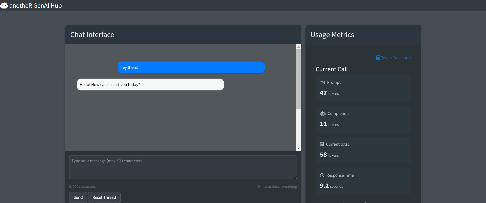
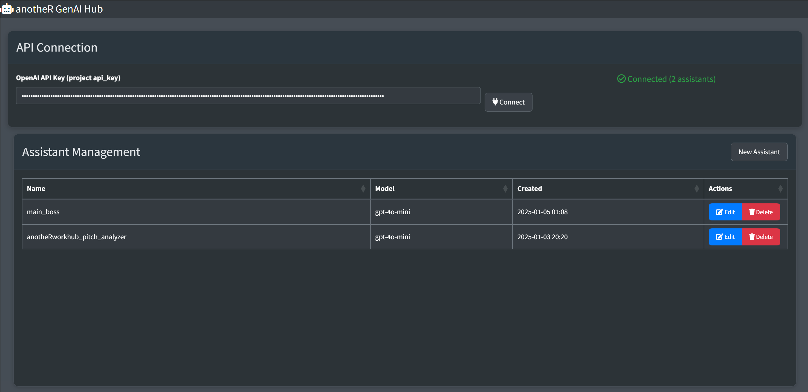
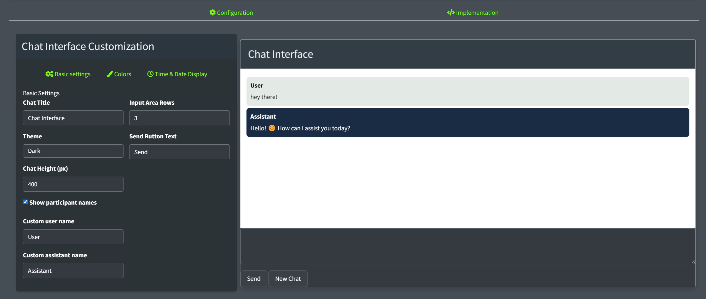

<!-- README.md is generated from README.Rmd. Please edit that file -->

# `{anotheRgenaihub}`

[](https://lifecycle.r-lib.org/articles/stages.html#experimental)
[](https://www.gnu.org/licenses/gpl-3.0)  
[](https://CRAN.R-project.org/package=anotheRgenaihub)
[](https://cran.r-project.org/)

A Shiny-powered platform for creating, managing, and chatting with AI
assistants using OpenAI’s technology. Also generates ready-to-use
templates for integrating AI assistants into your own Shiny apps.

## 🎯 What is this package for?

`anotheRgenaihub` lets you:  
- Create custom GEN-AI assistants for different tasks (currently only
ChatGPT supported)  
- Track performance metrics and usage statistics  
- Chat with your own assistants in real-time  
- Generate ready-to-use templates to integrate custom GEN-AI assistants
into your Shiny apps

### Chat Interface

<figure>

<figcaption aria-hidden="true">Chat Interface</figcaption>
</figure>

### Assistant Builder

Create and manage your AI assistants with a user-friendly interface:  


### Customization Options

Customize your chat interface with various themes and settings:  


### Template Generation

Generate ready-to-use code for your own Shiny apps: 

## 🔧 Quick Setup

``` r
# Install the package
if (!require("devtools")) install.packages("devtools")
devtools::install_github("anotherdataguy/anotheRgenaihub")

# Load and run
library(anotheRgenaihub)
run_app()
```

### Prerequisites

- An OpenAI API key ([Get one here](https://platform.openai.com))
- R installed on your system
- Add your API key to `.Renviron`: `API_KEYr=your_key_here`

### Access

If you’d like access to the app, feel free to reach out :

📧 Email: <g.cruzsaavedra@protonmail.com>

## 🛠️ Core packages

- {shiny} - [Web application
  framework](https://github.com/rstudio/shiny)  
- {bs4Dash} - [Bootstrap 4 dashboard
  components](https://bs4dash.rinterface.com/)  
- {golem} - [Framework for building production-grade Shiny
  apps](https://github.com/ThinkR-open/golem)  
- {shinyjs} - [JavaScript operations in
  Shiny](https://github.com/daattali/shinyjs)  
- {shinymanager} - [Authentication
  management](https://github.com/datastorm-open/shinymanager)  
- {DT} - [Data table interface](https://github.com/rstudio/DT)

## 📄 License

This project is licensed under the GNU General Public License v3.0 - see
the [LICENSE](LICENSE) file for details.

## ⚠️ Note

This tool requires an OpenAI API key and may incur usage charges based
on your interaction with the AI assistants.

Additionally:  
- Please note that this package is currently under development, and some
features may change or evolve.  
- Using the OpenAI GPT API generates costs. Be mindful that you are
responsible for any charges incurred from your usage.  
- Make sure to review OpenAI’s pricing model to avoid unexpected
expenses.
